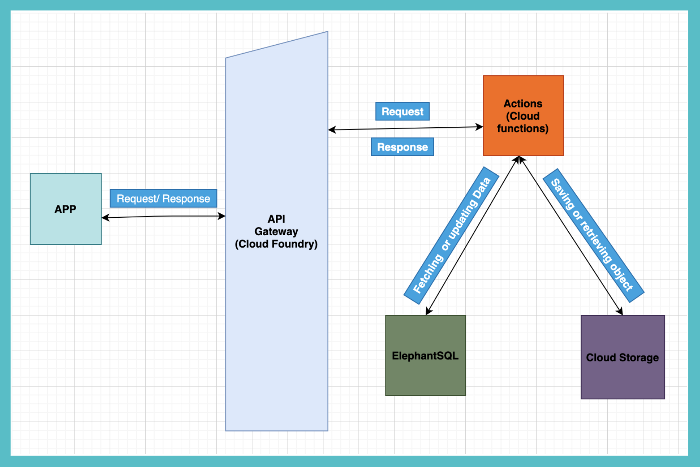

# Juju+

EDUtainment for Juniors, a moderated video sharing platform for the children, by the children!

## Contents

1. [Short description](#short-description)
1. [Demo video](#demo-video)
1. [Project overview](#project-overview)
1. [Getting started](#getting-started)
1. [Project roadmap](#project-roadmap)
1. [The architecture](#the-architecture)
1. [Live demo](#live-demo)
1. [Built with](#built-with)
1. [Authors](#authors)
1. [Acknowledgments](#acknowledgments)

## Short description

### What's the problem?

The lockdown has given a lot of time to children to get bored. There is **no fun, innovative, safe and well moderated video sharing** platform that allows children to create, share and watch videos

### How can technology help?

1.  Creating a way for kids to record their ideas as videos. 
1.  Finding a way for moderation of content by responsible adults who are close to these kids. 
1.  Eventually, sharing the approved videos with all the kids in the world.

### The idea

1.  Involving teachers as moderators, children currently studying in schools as content creators, and all children as viewers in an engaging video sharing platform
1.  Kids have to login, create a profile and select their interest areas. We have 6 interest areas as of now: Science, Maths, English, General Knowledge, Art and Talent. They can watch videos that have been uploaded by kids across the globe. They can also record their very own 45 second videos.
1.  Teachers login as mentors and can moderate (approve or reject) videos of kids from their own schools
1.  Kids send their videos to their mentors. Once approved, videos will be posted on Juju+ so that the entire world can enjoy them!

## Demo video

## Project overview

A few slides explaining the app in detail here: [Slides](https://docs.google.com/presentation/d/1YKWAuzix023t4VB09DJjb6bCT0Z4GGobfxXMQFkWW6o/edit?usp=sharing)

## Getting started

Download apk from live demo section, install it on your Android device. Open Juju+ app and present your kids with a creative wand to shoo away boredom intelligently!

## Project roadmap

## The architecture

1.  The user downloads the app and opens it.
2.  User can signup as student or as a mentor and login to the platform.
3.  Student can
    1.  watch videos uploaded by students around the world
    2.  comment on the videos (uploaded by themselves or others)
    3.  create new videos and send them to mentors for approval 
4.  Mentor can 
    1.  approve/reject the videos posted by students they are mentors to
    2.  watch the videos uploaded by students across the world
5.  The app stores the uploaded videos within Object Storage.

## Live demo

* Download android [apk](https://github.com/paramjeet-bankra/Juju/blob/master/AndroidAppData/JujuPlusApp.apk)

## Built with

* [IBM Cloud Functions](https://cloud.ibm.com/catalog?search=cloud%20functions#search_results) - The compute platform for handing logic
* [IBM API Connect](https://cloud.ibm.com/catalog?search=api%20connect#search_results) - The web framework used
* [IBM ElephantSQL](https://cloud.ibm.com/catalog/services/elephantsql) - sql database to store user details and their videos details
* [NodeJs](https://nodejs.org/en/docs/) - Server side framework
* [IBM Cloud Object strorage](https://cloud.ibm.com/catalog?search=cloud%20object%20storage#search_results) - Used to store user videos
* [Kotlin](https://kotlinlang.org/docs/tutorials/getting-started.html) - used for creating android app

## Authors

* **Paramjeet Kaur Bankra** - *Initial work* (https://github.com/paramjeet-bankra/Juju)
* **Sarina Dhamija** - *Initial work* (https://github.com/paramjeet-bankra/Juju)
* **Chitra Gupta** - *Initial work* (https://github.com/paramjeet-bankra/Juju)
* **Prachi Shrivastava** - *Initial work* (https://github.com/paramjeet-bankra/Juju)

## Acknowledgments

* **Vikas Kumar** -*Special Thanks to Vikas for mentoring throughout the journey*
